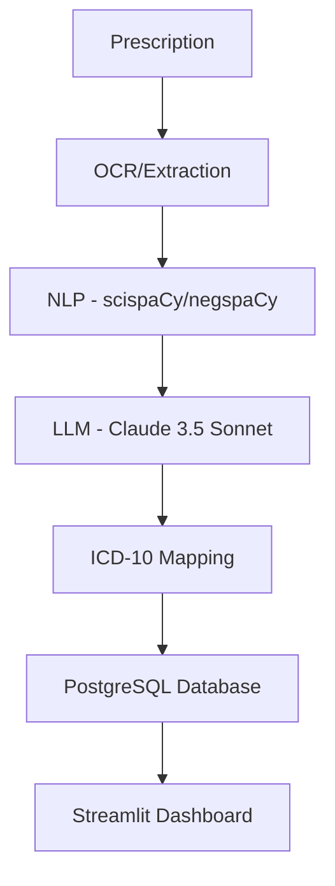

# Architecture Documentation - Medical ICD Mapper

## Overview
The system is designed to automate the clinical coding process for medical prescriptions. It uses a combination of rule-based NLP and LLM-based reasoning to ensure high accuracy and clinical relevance.

## Components

### 1. Data Ingestion
- Accepts images (JPG/PNG) or PDF files.
- Uses an OCR engine (e.g., Tesseract or Azure Read API) for initial text extraction.

### 2. Clinical Entity Recognition (CER)
- **NLP Layer:** uses `scispaCy` with the `en_core_sci_lg` model to identify medical terms.
- **Negation Detection:** uses `negspaCy` to filter out non-existent conditions (e.g., "no history of diabetes").

### 3. LLM Refinement & ICD Mapping
- Clinical entities are sent to Claude 3.5 Sonnet.
- The LLM performs:
  - **MEAT Validation:** Verifies if the condition is Monitored, Evaluated, Assessed, or Treated.
  - **ICD Resolution:** Maps terms to the most specific ICD-10 code.

### 4. Storage & Audit
- All processing steps, including LLM prompts and raw NLP outputs, are stored in PostgreSQL for audit and quality assurance.

## Data Flow

